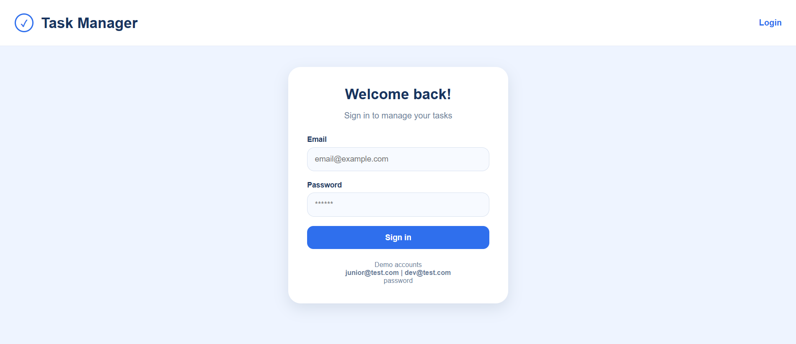
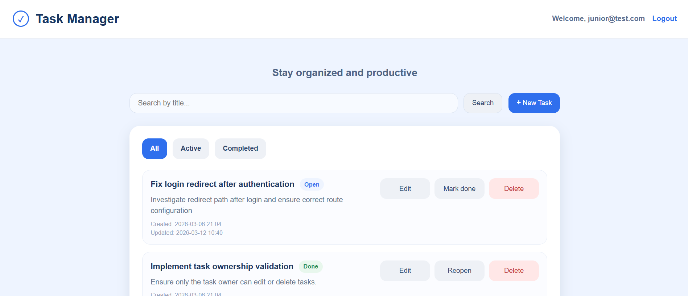
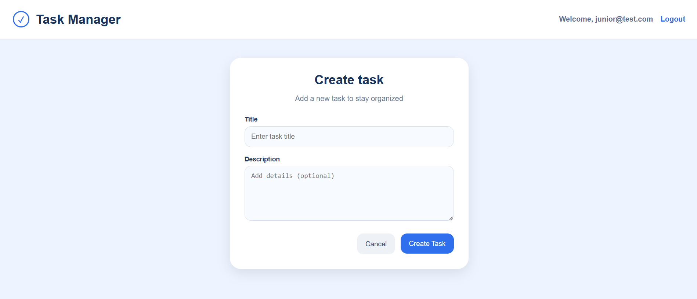
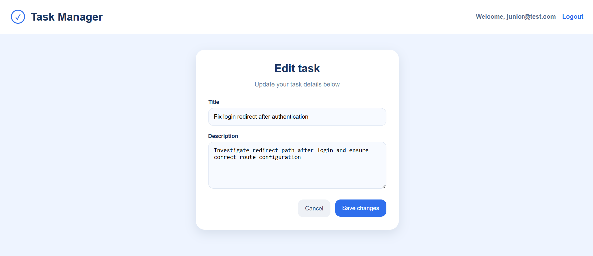

# Mini Task Manager (Symfony)

A simple task management web application that allows users to create, edit, delete, and organize their tasks while keeping them private to their account.

This project was built to practice Symfony fundamentals such as authentication, CRUD operations, Doctrine ORM, form handling, and user-specific data access.

## Features

- User authentication (**login** / **logout**)
- **Create** new tasks
- **Edit** existing tasks
- **Delete** tasks
- Mark tasks as **done** or **reopen** them
- **Filter** tasks:
  - All
  - Active
  - Completed
- **Search** tasks by title
- Tasks belong only to the logged-in user
- CSRF protection for forms
- Clean UI using Twig templates and custom CSS
- Redirect handling for authenticated / unauthenticated users

## Tech Stack

### Backend
- PHP 8.2.30
- Symfony 7.4.6
- Doctrine ORM

### Frontend
- Twig
- HTML
- CSS

### Database
- SQLite

### Tools
- Composer
- Symfony CLI
- Git

## Project Structure

```
assets/
└── styles/

src/
├── Controller/
├── DataFixtures/
├── Entity/
├── Form/
├── Repository/
└── Security/

templates/
├── task/
└── security/
```

Main components include:

- **TaskController** – task CRUD operations  
- **SecurityController** – login/logout handling  
- **LoginFormAuthenticator** – authentication logic  
- **TaskRepository** – filtering and search logic  

## Installation

1. Clone the repository:

`git clone https://github.com/iased/mini-task-manager.git`

2. Install dependencies:

`composer install`

3. Create the database:

`php bin/console doctrine:database:create`

4. Run migrations:

`php bin/console doctrine:migrations:migrate`

5. Load fixtures:

`php bin/console doctrine:fixtures:load`

6. Start the local server:

`symfony server:start`

7. Open in browser:

`http://127.0.0.1:8000`

## Demo Login

Use one of the following test accounts:

- **Email:** junior@test.com  
  **Password:** password

- **Email:** dev@test.com  
  **Password:** password

## Future Improvements

- Task due dates
- Task priority levels
- Pagination for large task lists
- User registration
- Task categories or tags

## Screenshots

### Login Page



### Tasks Dashboard



### Create Task



### Edit Task


